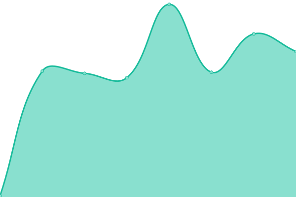
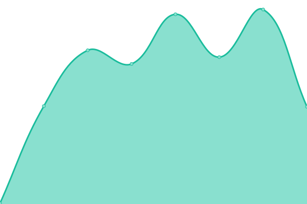

# [📈 Live Status](https://status.pololer.my.id): <!--live status--> **🟧 Partial outage**

This repository contains the open-source uptime monitor and status page for [Rizky Pratama](https://www.pekmen.my.id/), powered by [Upptime](https://github.com/upptime/upptime).

With [Upptime](https://upptime.js.org), you can get your own unlimited and free uptime monitor and status page, powered entirely by a GitHub repository. We use [Issues](https://github.com/Aruh1/status/issues) as incident reports, [Actions](https://github.com/Aruh1/status/actions) as uptime monitors, and [Pages](https://status.pololer.my.id) for the status page.

<!--start: status pages-->
<!-- This summary is generated by Upptime (https://github.com/upptime/upptime) -->
<!-- Do not edit this manually, your changes will be overwritten -->
<!-- prettier-ignore -->
| URL | Status | History | Response Time | Uptime |
| --- | ------ | ------- | ------------- | ------ |
|  [pololer](https://pololer.yurasu.xyz/) | 🟥 Down | [pololer.yml](https://github.com/Aruh1/status/commits/HEAD/history/pololer.yml) | 

 0ms
     
 | 

<a href="https://status.pololer.my.id/history/pololer">0.00%</a>
    

|  [DDL pololer](https://www.pololer.web.id/0:/) | 🟥 Down | [ddl-pololer.yml](https://github.com/Aruh1/status/commits/HEAD/history/ddl-pololer.yml) | 

 0ms
     
 | 

<a href="https://status.pololer.my.id/history/ddl-pololer">0.00%</a>
    

|  [Embedded Video](https://v.pololer.web.id/) | 🟥 Down | [embedded-video.yml](https://github.com/Aruh1/status/commits/HEAD/history/embedded-video.yml) | 

 0ms
     
 | 

<a href="https://status.pololer.my.id/history/embedded-video">0.00%</a>
    

|  [Cloudflare 1.1.1.1](1.1.1.1) | 🟩 Up | [cloudflare-1-1-1-1.yml](https://github.com/Aruh1/status/commits/HEAD/history/cloudflare-1-1-1-1.yml) | 

 4ms
     
 | 

<a href="https://status.pololer.my.id/history/cloudflare-1-1-1-1">100.00%</a>
    

<!--end: status pages-->

[**Visit our status website →**](https://status.pololer.my.id)

## 📄 License

- Powered by: [Upptime](https://github.com/upptime/upptime)
- Code: [MIT](./LICENSE) © [Rizky Pratama](https://www.pekmen.my.id/)
- Data in the `./history` directory: [Open Database License](https://opendatacommons.org/licenses/odbl/1-0/)
